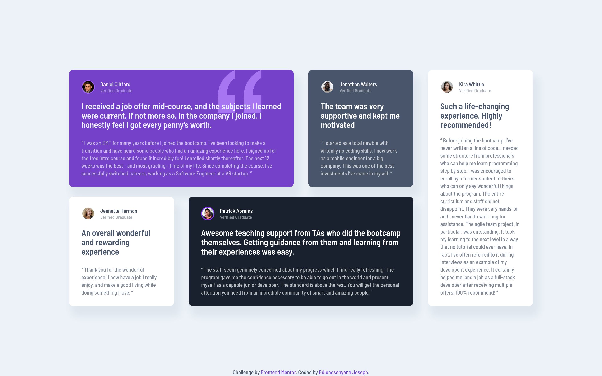

# Frontend Mentor - Testimonials grid section solution

This is a solution to the [Testimonials grid section challenge on Frontend Mentor](https://www.frontendmentor.io/challenges/testimonials-grid-section-Nnw6J7Un7). Frontend Mentor challenges help you improve your coding skills by building realistic projects.

## Table of contents

- [Overview](#overview)
  - [The challenge](#the-challenge)
  - [Screenshot](#screenshot)
  - [Links](#links)
- [My process](#my-process)
  - [Built with](#built-with)
  - [What I learned](#what-i-learned)
  - [Continued development](#continued-development)
  - [Useful resources](#useful-resources)
- [Author](#author)

## Overview

### The challenge

Users should be able to:

- View the optimal layout for the site depending on their device's screen size

### Screenshot



### Links

- Solution URL: [Add solution URL here](https://your-solution-url.com)
- Live Site URL: [https://iediong.github.io/fem-testimonials-grid-section/](https://iediong.github.io/fem-testimonials-grid-section/)

## My process

### Built with

- Semantic HTML5 markup
- CSS custom properties
- Flexbox
- CSS Grid
- Mobile-first workflow

### What I learned

I finally got to learn and use CSS Grid in a project. Big thanks to [Wes Bos](https://github.com/wesbos) for his wonderful speech in the Laravel conf on CSS Grid, it really helped me with understanding CSS Grid.

I also got to use the new CSS `margin-inline` property in this project.

See how I used it below:

```css
.container {
  width: 84%;
  max-width: 1110px;
  margin-inline: auto;
}
```

```css
.attribution {
  position: relative;
  margin-inline: auto;
}
```

### Continued development

I would like to continue practicing and building more projects using CSS Grid.

### Useful resources

- [CSS Grid in 45 Minutes!](https://www.youtube.com/watch?v=DCZdCKjnBCs) - This video by [Wes Bos](https://www.youtube.com/channel/UCoebwHSTvwalADTJhps0emA) over on YouTube helped me apply and refresh my knowledge of CSS Grid. I really like the way he makes it simple to understand and remember all in 45 minutes.

## Author

- LinkedIn - [@IEdiong](https://www.linkedin.com/in/iediong)
- Frontend Mentor - [@IEdiong](https://www.frontendmentor.io/profile/iediong)
- Twitter - [@IEdiong](https://www.twitter.com/iediong)
